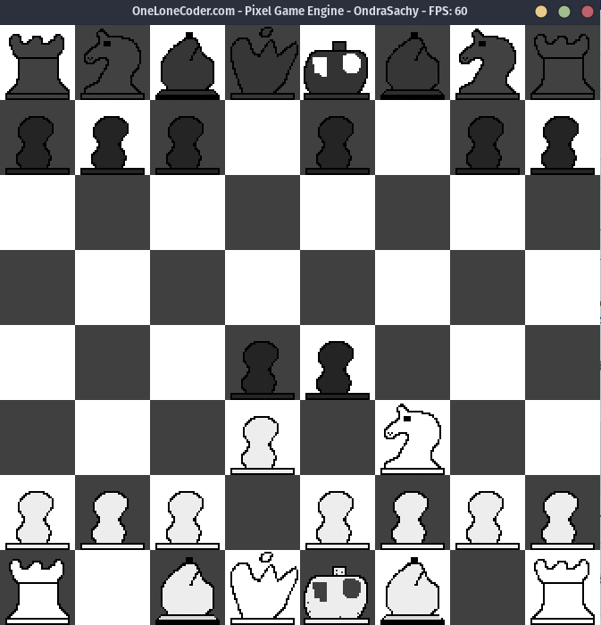

# Šachový engine
## popis projektu
Tento projekt byla moje maturitní práce. Je to šachový engine s vlastním GUI a databází. Používá alfa beta pruning, transpoziční tabulky, bitmapy, základní evaluaci pozic a ještě vlastní key-value databáze pohybů.

## Postup kompilace
Nainstalujte si tyto dependence, které obsahují kompilátor a knihovny potřebné pro GUI
```bash
sudo apt install build-essential libglu1-mesa-dev libpng-dev
```
Poté vytvoříte makefile pomocí cmake a zkompilujete projekt příkazem make.
```bash
cmake .
make
```
a nakonec spustíte program v adresáři src
```bash
cd src
./gui_chess
```



## struktura repozitáře
📦chess_gitlab\
┣ 📂Dokumentace\
┃ ┗ 📜document.pdf // dokumentace práce\
┣ 📂src\
┃ ┣ 📂BitboardMaker\
┃ ┃ ┗ 📜main.cpp // generuje heatmapu pozic pro koně\
┣ ┣ 📂off_topic_scripty\
┃ ┃ ┗ 📜generate_heatmap.py // generuje heatmapu pozic pro koně\
┣ ┣ 📂gui\
┃ ┃ ┗ 📜main.cpp // GUI k enginu\
┃ ┣ 📜Board.cpp\
┃ ┣ 📜Board.h  // reprezentace herního pole a pohybů\
┃ ┣ 📜CMakeLists.txt\
┃ ┣ 📜debug.cpp\
┃ ┣ 📜debug.h  // metody pro snadnější debugování\
┃ ┣ 📜eval.cpp\
┃ ┣ 📜eval.h // hodnotí pozice\
┃ ┣ 📜MoveGenerator.cpp\
┃ ┣ 📜MoveGenerator.h // generuje legální a pseudolegální pohyby\
┃ ┣ 📜main.cpp Pouzival jsem pro zkouseni metod. Momentalne parsuje databazi do souboru. \
┃ ┣ 📜openingbook.data zparsovaná databáze vhodných tahů do hloubky 14 tahů \
┃ ┣ 📜openingbook.index\
┃ ┣ 📜PgnParser.cpp\
┃ ┣ 📜PgnParser.h  // parsuje pgn formát a vytváří indexovaný databázi pozic\
┃ ┣ 📜PrecomputedBitboards.cpp \
┃ ┗ 📜PrecomputedBitboards.h // předpočítané bitboardy pro generování pohybů\
┣ 📂tests\
┃ ┣ 📜perft.cpp // testuje generátor pohybů podle poctu vygenerovanych pohybů\
┃ ┗ 📜CMakeLists.txt\
┣ 📜.gitignore\
┣ 📜.gitlab-ci.yml\
┣ 📜CMakeLists.txt\
┗ 📜README.md\
 

